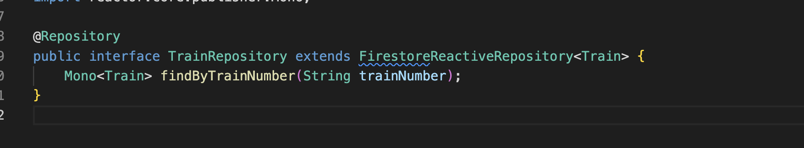

# Feedback

## Train API 🚆

1. Like the addition of a `readme` at the start - could also feature a few instructions for other developers on how to start up the server etc.

2. I like how the validation logic is being done at the model level (i.e. when constructors called)

3. I don't quite understand why you need `Error` / `ErrorException` classes when you've already got `Exception` classes in-built. I think this is possibly something to do with the naming that suggests an issue to me here.

4. This `if` statement feels a little too busy at the moment:

```java
if (sighting.getTrain() == null
        || sighting.getTrain().getName() == null || sighting.getTrain().getName().isEmpty()
        || sighting.getTrain().getColour() == null || sighting.getTrain().getColour().isEmpty()
        || sighting.getTrain().getTrainNumber() == null || sighting.getTrain().getTrainNumber().isEmpty()
        || sighting.getStation() == null
        || sighting.getStation().getName() == null || sighting.getStation().getName().isEmpty()
        || sighting.getTimestamp() == null || sighting.getTimestamp().isEmpty()) {
            throw new ErrorException(
                 "E001",
                  "Train, Station, and Timestamp are required and must not be empty",
                 HttpStatus.BAD_REQUEST
                );
            }
```
Consider abstracting this logic or changing when a sighting object gets instantiated.

5. Are you implementing this method `findByTrainNumber`: 
